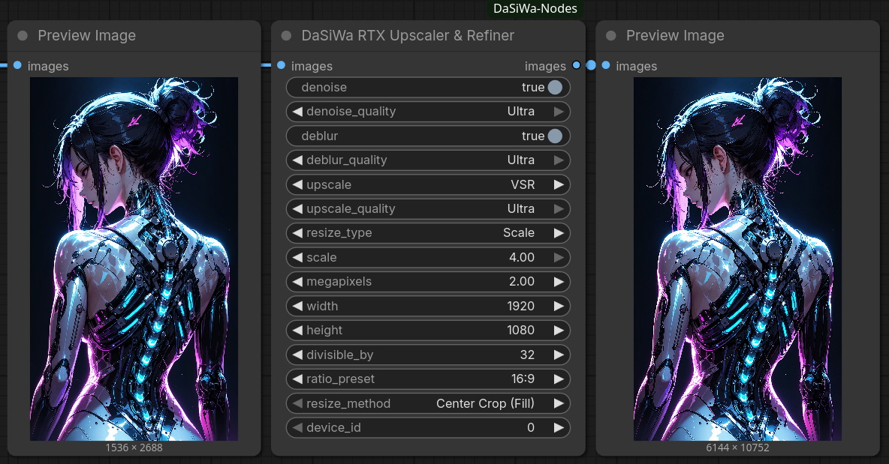
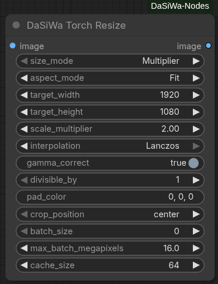
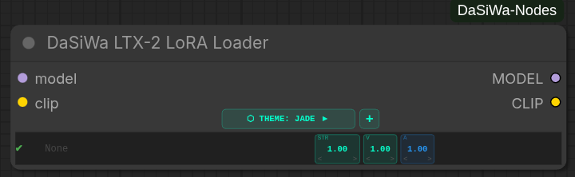
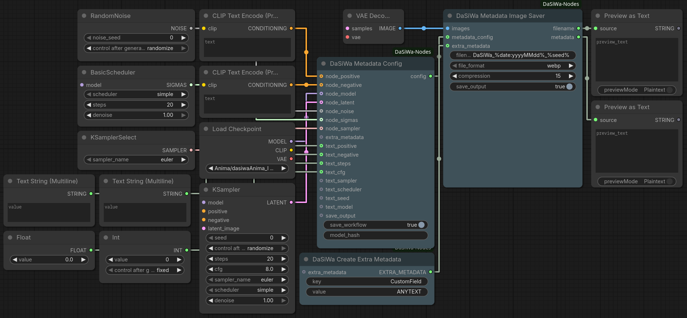
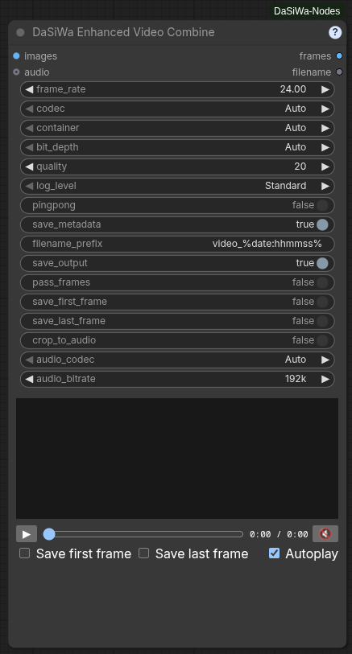
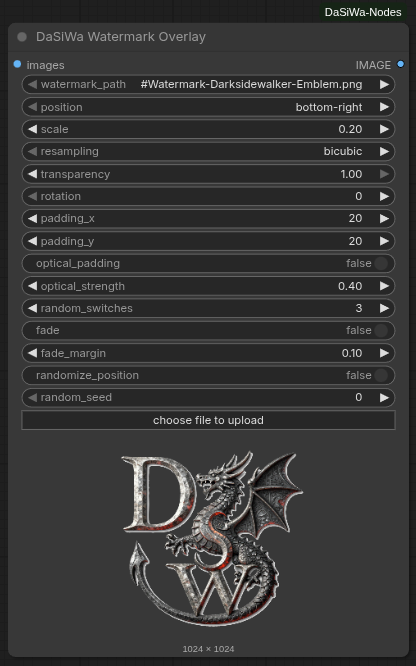
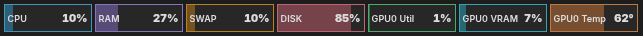
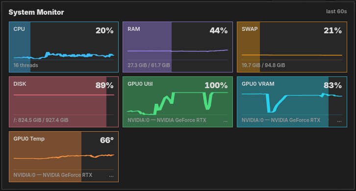
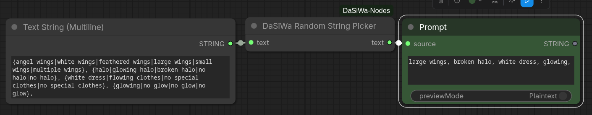

# DaSiWa Custom Nodes Collection

A high-performance collection of custom nodes for ComfyUI, optimized for video workflows, resolution management, and logic control.

## Included Nodes

---

### 💎 RTX Upscaler & Refiner

State-of-the-art image and video enhancement using NVIDIA RTX Video SDK. It executes up to three sequential passes (Denoise, Deblur, and Upscale) in a single node, processing frame-by-frame to keep VRAM usage predictable and low.

- **Refine:** Independent Denoise and Deblur passes.
- **Upscale:** AI-powered VSR and High Bitrate upscaling.
- **Smart Sizing:** Multiple resize modes including Constant Megapixel targets.
- **Efficiency:** Frame-by-frame processing for minimal VRAM usage.



[Full documentation →](docs/rtx_upscaler_refiner.md)

---

### 📐 Resolution Scale Calculator

The **DaSiWa Scale Calculator** provides mathematically precise resolution management for high-performance video models. It uses a **Constant-Area Square-Root method** to ensure that your GPU VRAM usage remains stable regardless of the aspect ratio.

- **Unified Resolution Presets:** Pick standard `p` targets from 144p to 2160p/4K or optimized megapixel tiers from one dropdown.
- **Clear Aspect Modes:** `IMAGE ASPECT` uses the connected image shape; `USE ASPECT BELOW` uses the always-visible aspect controls.
- **Video-Safe Snapping:** Standard, Div32, Div64, and custom divisor modes keep dimensions aligned for different model families.


[Full documentation →](docs/ResolutionScaleCalculator.md)

---

### ⚡ Torch Resize

A drop-in replacement for ComfyUI's built-in resize nodes that keeps images sharp and video workflows fast without extra dependencies.

- **Sharper results:** Lanczos resampling with optional sRGB-to-linear gamma correction produces cleaner upscaling and downscaling than native bilinear/bicubic.
- **Video-friendly batching:** Automatically splits long frame sequences into memory-safe chunks so you never run out of VRAM, while keeping output order intact.
- **Zero extra installs:** Runs entirely on the PyTorch build ComfyUI already uses — no Pillow, torchlanc, Triton, or vendor SDK required.
- **Precise sizing control:** Divisible-by alignment, five aspect modes (fit, fill/crop, pad, stretch, long-side crop), and configurable crop/pad placement eliminate guesswork for downstream model constraints.
- **Alpha preserved:** Transparency channels are resized independently without gamma conversion artifacts.



[Full documentation →](docs/torch_resize.md)

---

### 🎛️ Node Status Switch

The **DaSiWa Node Status Switch** lets you mute or bypass any node in your workflow using a single toggle. Targets are registered by wiring their outputs into the switch's input slots, which grow dynamically as you connect more nodes (up to 99).


[Full documentation →](docs/node_status_switch.md)

**Quick start:**

1. Add a **DaSiWa Node Status Switch** to your workflow
2. Drag any **output** from the node(s) you want to control into the switch's `target_01` input — new slots appear as you connect more
3. Set `action` to `mute` or `bypass` and configure `trigger_on` to taste
4. Toggle `enabled` directly on the switch

---

### 🎬 LTX-2 Lora Loader

The **DaSiWa LTX-2 Lora Loader** is a 10-slot LoRA stacker designed for LTX-2.3 video generation. LTX-2.3 is unique because it generates both video and audio from separate transformer branches. This node gives you independent control over how LoRAs affect video vs. audio.

- **Dual-Branch Control:** Adjust video (V×) and audio (A×) multipliers independently per LoRA.
- **10 LoRA Slots:** Stack up to 10 LoRAs with fine-grained strength control (STR: −2.0 to +2.0).
- **Key Count Indicator:** Auto-scans each LoRA to show video/audio key counts before generation.
- **6 Themes:** Switch between Jade, Neon, Studio, Chrome, OLED, and Wood color schemes.
- **Searchable UI:** Quick LoRA search with live filtering in the node itself.



[Full documentation →](docs/ltx2_loader.md)

---

### 💾 Metadata Image Saver (Civitai Ready)

The **DaSiWa Metadata Image Saver** ensures your images are fully compatible with Civitai, Hugging Face, and other galleries by embedding A1111-style metadata. It automatically detects LoRAs used in the workflow and supports dynamic filenames.

- **Civitai Compatibility:** Writes the standard `parameters` block for auto-parsing of prompts and resources.
- **LoRA Detection:** Scans your workflow and appends `<lora:name:weight>` triggers automatically.
- **WebP Support:** Full "Drag-and-Drop" workflow reconstruction support for both PNG and WebP formats.
- **Dynamic Filenames:** Use placeholders like `%seed%`, `%date%`, `%model%`, `%width%`, and `%height%`.
- **Privacy:** Toggle workflow JSON embedding to share images without exposing your full graph.



[Full documentation →](docs/metadata_image_saver.md)

---

### 🎞️ Enhanced Video Combine

The **DaSiWa Enhanced Video Combine** turns an `IMAGE` batch into a high-quality video with optional ComfyUI `AUDIO` muxing, an in-node VHS-style preview, and a set of enhanced automations that choose safe output settings instead of relying on a fixed encoder setup.



- **Enhanced host-aware encoding automation:** `Auto` runtime-tests AV1 → H.265/HEVC → VP9 → H.264 and selects the first encoder that actually works on the host, preferring NVIDIA NVENC, then other GPU encoders (Intel QSV, AMD AMF, VAAPI), then software.
- **Enhanced container and codec safety automation:** Chooses compatible WebM/MKV/MP4 combinations per codec and retains a mandatory H.264/MP4 fallback if every preferred combination fails.
- **Enhanced precision and preview automation:** Detects 8-bit versus 10-bit source-frame precision; H.265 keeps its requested final output while an H.264 sidecar is generated automatically for browsers without HEVC playback.
- **Enhanced output automation:** The node always re-encodes when queued, supports ping-pong loops, preserves optional workflow metadata, and names audio outputs with `-audio`.
- **Asset-panel frame automation:** Enable **Save first frame** and/or **Save last frame** to write PNGs next to the video with matching names and publish the video plus each generated PNG to ComfyUI Assets.
- **Audio controls and preview behavior:** Mux connected audio, select audio codec/bitrate, optionally crop the video to audio duration, and hover the in-node preview to unmute it automatically.
- **Concise diagnostics:** Always writes compact ComfyUI CLI logs for codec/container selection, the actual video encoder, and the resolved audio encoder/bitrate (for example, `audio=libopus/192k`), plus output path and relevant fallbacks—without a logging toggle.
- **Built-in help:** Click the small `?` at the right side of the node title for a concise setting reference.

[Full documentation →](docs/enhanced_video_combine.md)

---

### 🎬 Watermark Overlay

A professional-grade watermark tool optimized for image and video batches. It uses a stable CPU compositor with high-quality resampling and precise rotation.

- **Dynamic Random Positioning:** Toggle seeded corner cycling while keeping the selected position as the start position.
- **Splash Mode:** Configure dynamic fade-in and fade-out at the start and end of clips for professional branding.
- **Optical Padding:** Automatically adjusts placement by the watermark's visual center of mass for perfect alignment.
- **Stable Compositing:** Output frames are initialized from the source batch before the watermark region is blended, avoiding flicker and black-frame artifacts.



[Full documentation →](docs/watermark.md)

---

### 🖥️ System Monitor

A compact system telemetry bar integrated directly into the ComfyUI top toolbar. The adjacent DaSiWa settings button lets you hide the monitor or choose its display mode.

- **Multi-GPU Support:** Separate metrics per GPU device (NVIDIA, AMD, Intel) labeled as GPU0, GPU1, etc.
- **Resource Metrics:** CPU, RAM, SWAP/Pagefile, DISK, GPU Utilization, GPU VRAM, and GPU Temperature.
- **Visual Feedback:** Color-coded borders and proportional background fills (0–100%) for instant at-a-glance assessment.
- **Lite / Full Modes:** Lite is the default compact toolbar view; Full shows every available metric with detailed values and a live 60-second graph.
- **Responsive Layout:** Lite automatically hides lower-priority metrics when toolbar space is limited; Full is a scrollable panel that adapts to narrow screens.
- **Cross-Platform:** Works on Linux and Windows with automatic fallback detection for GPU tools.
- **Independent Placement:** Renders as its own toolbar element, not dependent on third-party extensions.

**Lite mode**



**Full mode**



[Full documentation →](docs/system_monitor.md)

---

### 🔀 Random String Picker

Bridge any string/text node through **DaSiWa Random String Picker** to randomize prompt variants inline.

- **Text passthrough:** Accepts a connected `STRING` input and returns a `STRING` output.
- **Inline variants:** Replaces every `{A|B|C}` segment with one randomly selected option.
- **Multiple groups:** Processes any number of groups independently, such as `{red|blue} car in {sun|rain}`.
- **Literal passthrough:** Text outside complete `{...}` groups is left unchanged.



[Full documentation →](docs/random_string_picker.md)

---

### 🧠 LLM / VLM Analyze

The **DaSiWa LLM / VLM nodes** let you run local transformers chat or vision-language models from inside a ComfyUI workflow. They accept native `STRING` inputs and native `IMAGE` batches from nodes such as Load Image or VHS frame loaders.

- **Native ComfyUI Inputs:** Analyze connected text, still images, or video/image-sequence frame batches.
- **Prompt Presets:** Custom system instructions, LTX-2.3/Wan2.2 video prompt enhancement, and image/video caption presets for mixed tags, tag-only, or natural language.
- **Memory Modes:** Keep models cached for speed, unload after each response, or use the Analyze node cleanup switch to free RAM/VRAM before later steps.
- **Frame Sampling:** Limit video analysis with max frames, stride, frame strategy, resize controls, context limits, and optional KV-cache reduction.
- **Local or HF Models:** Load full model folders from `ComfyUI/models/llm`, or download a Hugging Face repo id into that folder when missing.

[Full documentation →](docs/llm_nodes.md)

---

## 🛠️ Installation

### Manual install

1. Activate your venv inside your ComfyUI folder
2. Clone this repo into your `custom_nodes` folder:
   ```bash
   git clone https://github.com/darksidewalker/ComfyUI-DaSiWa-Nodes
   ```
3. Install all dependencies:
   ```bash
   pip install -r requirements.txt
   ```
4. **Requirement:** NVIDIA RTX GPU with drivers 530+. (Windows users may need the NVIDIA Broadcast SDK; Linux usually works out-of-the-box with the pip package).
5. Restart ComfyUI.

### Use ComfyUI-Manager

Search for **DaSiWa-Nodes** and install.

---

## Credits

- The RTX implementation in this collection is based on the excellent work by [Deno2026/comfyui-deno-custom-nodes](https://github.com/Deno2026/comfyui-deno-custom-nodes).
- Lora-Loader is based on [Brojakhoeman/Loradaddyloaderltx](https://github.com/Brojakhoeman/Loradaddyloaderltx/tree/main).
- Ideas for Watermark Overlay are inspired by [Artificial-Sweetener/comfyui-WhiteRabbit](https://github.com/Artificial-Sweetener/comfyui-WhiteRabbit)
