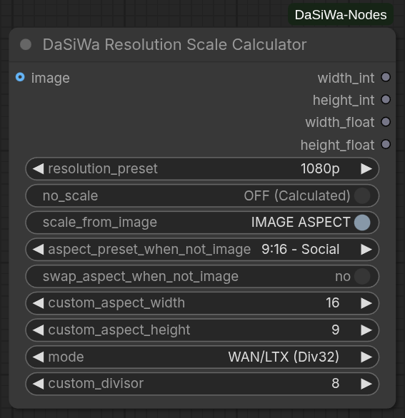

# DaSiWa Custom Nodes Collection

## Included Nodes

### Resolution Scale Calculator

The **DaSiWa Scale Calculator** provides mathematically precise resolution management for high-performance video models. It uses a **Constant-Area Square-Root method** to ensure that your GPU VRAM usage remains stable regardless of the aspect ratio.



# 🛠 Installation

## Manual install

1. Activate your venv inside your comfyui folder

2. Clone this repo into your `custom_nodes` folder:
   ```
   git clone https://github.com/darksidewalker/ComfyUI-DaSiWa-Nodes
   ```

3. Install all dependencies    
e.g.
    ```
    uv pip install -r requirements.txt
    ```
## Use ComfyUI-Manager

Search for DaSiWa-Nodes and install