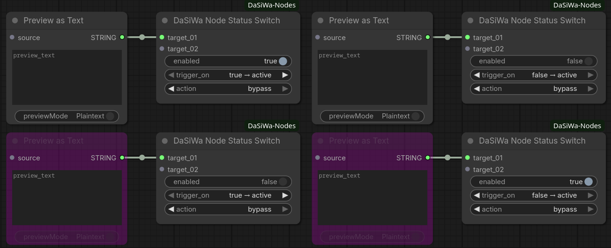

# DaSiWa Custom Nodes Collection

## Included Nodes

---

### Resolution Scale Calculator

The **DaSiWa Scale Calculator** provides mathematically precise resolution management for high-performance video models. It uses a **Constant-Area Square-Root method** to ensure that your GPU VRAM usage remains stable regardless of the aspect ratio.


[Full documentation →](ResolutionScaleCalculator.md)

---

### Node Status Switch

The **DaSiWa Node Status Switch** lets you mute or bypass any node in your workflow using a single toggle. Targets are registered by wiring their outputs into the switch's input slots, which grow dynamically as you connect more nodes (up to 99).



[Full documentation →](node_status_switch.md)

**Quick start:**

1. Add a **DaSiWa Node Status Switch** to your workflow
2. Drag any **output** from the node(s) you want to control into the switch's `target_01` input — new slots appear as you connect more
3. Set `action` to `mute` or `bypass` and configure `trigger_on` to taste
4. Toggle `enabled` directly on the switch

---

# 🛠 Installation

## Manual install

1. Activate your venv inside your ComfyUI folder
2. Clone this repo into your `custom_nodes` folder:
   ```
   git clone https://github.com/darksidewalker/ComfyUI-DaSiWa-Nodes
   ```
3. Install all dependencies, e.g.:
   ```
   uv pip install -r requirements.txt
   ```

## Use ComfyUI-Manager

Search for **DaSiWa-Nodes** and install.
