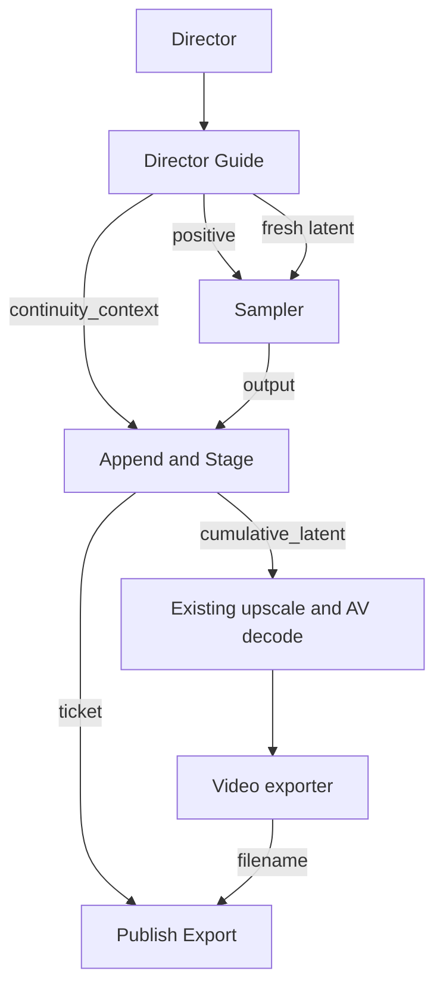

# H3 Director Continuity 1.1.0

The Director owns the controls. Continue is a view of the selected H3 model family, not a seventh model mode. Capture is opt-in for New takes; older workflows with capture off retain the native path.

## Two sources, one continuation path

| Source | Preparation | Conditioning |
| --- | --- | --- |
| Completed H3 checkpoint | Load immutable video/audio latent | Native AV latent-tail guide |
| Ordinary uploaded video | Probe/preview without models; encode with the connected H3 video/audio VAEs inside the queue | The same native AV latent-tail guide |

For ordinary video, use **Choose start video…**, edit the Continue prompt, and queue. No separate import node or LLM configuration is needed. `ffmpeg` and `ffprobe` must be on PATH. H3 video and audio VAEs are both required, including for silent inputs. A content hash protects a pinned upload against replacement. Imports are reused for the same session, source, canvas and model family; use a new session when changing the H3 codec weights.

The importer preserves the full source at 24 fps, fits it to the Director canvas with padding, and adds at most 16 repeated first frames at the **beginning** to satisfy 17k+5. Matching leading silence keeps AV alignment. No grid padding freezes the source ending. Audio is stereo 32 kHz and sized to the native globally rounded 40 Hz token boundary. Source media is VAE-reconstructed, not stream-copied.

## Wiring

| From | To | Purpose |
| --- | --- | --- |
| Director.guide | Director Guide.guide | Mode, canvas, separate continuation prompt and source selection |
| Director Guide.positive | BasicGuider.conditioning | Active native tail conditioning |
| Director Guide.latent | SamplerCustomAdvanced.latent_image | Bounded fresh AV sample window |
| Director Guide.continuity_context | Append & Stage.context | Pinned parent, timing and run identity |
| SamplerCustomAdvanced.output | Append & Stage.sampled | Generated joint video/audio latent |
| Append & Stage.cumulative_latent | Existing latent upscale, then video/audio decode | Keep the source prefix and append only new AV tokens |
| Append & Stage.ticket | Publish Export.ticket | Identify this staged checkpoint |
| Enhanced Video Combine.filename | Publish Export.filename | Wait for and validate this actual export |

The supplied workflow exposes `continuity_ticket` from Settings and places Publish at the root. Do not feed the export filename back into Settings or substitute an unrelated Set/Get filename. The visible root graph contains model/CLIP paths through Settings in both directions; the expanded node dependencies are acyclic.

## User controls

- **Keep take for Continue:** capture the next ordinary take; rounded orange toggle with a checkmark.
- **Continue:** edit a separate, prefilled prompt. Normal prompt text remains available when returning to an ordinary mode.
- **Choose start video…:** select and upload a movie even if no latent checkpoint exists.
- **Use last completed / Use finished result:** explicitly select a ready source. Completing a job never silently advances the pinned source.
- **Match source settings:** restore a saved checkpoint's dimensions, mode and 24 fps. Connected external dimensions must be changed upstream.
- **New frames:** multiples of 17. Default 119 new frames plus 22 hidden context frames gives a 141-frame sample window, approximately 4.96 seconds of added output.
- **Advanced:** context length, session and optional REF2VA timeline references. For a short source, choose a context no longer than the source.
- **Analyze → Draft → Apply draft:** uses the existing Prompt Forge model/settings. A vision-capable model receives chronological tail thumbnails when available; text-only fallback is labelled. Audio is never analyzed. The idea is cleared after application because the draft already incorporates it. Changed source/idea/duration/prompt invalidates a draft.

Continuation ignores first/last-frame anchors and, by default, REF2VA timeline references. This avoids competing anchors and stale file dependencies. Enable **Keep REF2VA timeline references** when reference media should still influence the new segment. This preference affects only Continue.

## Integrity and resource costs

Checkpoints live under `output/df_h3_continuity/<session>/<clip_id>`. `latent.safetensors` holds both streams; `clip.json` records timing, parent and provenance. `_imports` holds upload manifests/previews. A staged sample is never offered as a completed result until export succeeds and its duration matches. Downstream ping-pong or time trimming is incompatible; duration-preserving interpolation is allowed. Failed exports leave the source pinned.

Video import uses temporary disk-backed RGB and public VAE calls of at most 124 frames. The chunk plan follows native H3's independent 17-frame encoder chunks with the three-token drop applied only at the final boundary. Audio encoding and cumulative latent/decode still scale with total length. Importing arbitrary input does not make hour-long material inexpensive.

No model monkeypatch is installed. Native tail/window/append code remains the MIT-licensed [ttulttul continuation implementation](https://github.com/ttulttul/ComfyUI-Minimax-H3-Continuation), with its license retained in `nodes/h3_continuity/vendor/LICENSE`. Native ComfyUI arbitrary-frame guides are required. The source prefix is exact at the latent level; re-decoding or postprocessing may change prior pixels/audio.

CPU, media and browser harness tests do not establish visual/acoustic seam quality. Perform the GPU acceptance runs described in the package's maintainer notes before treating this as production-validated.
